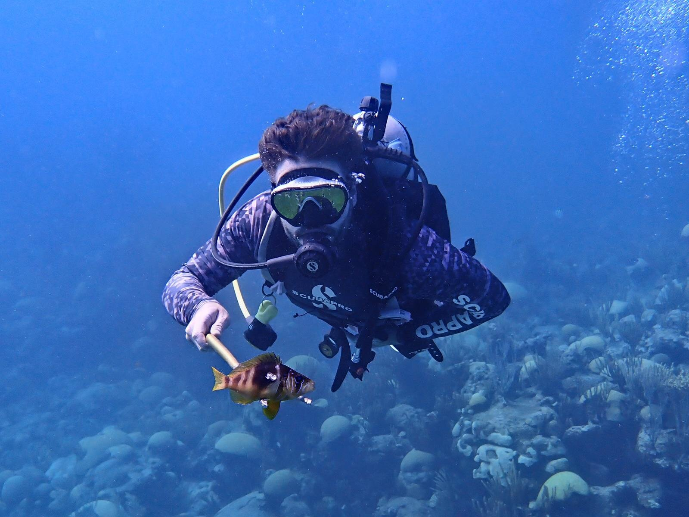
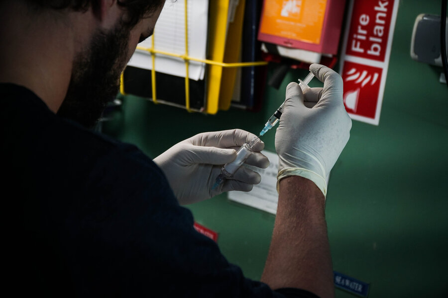
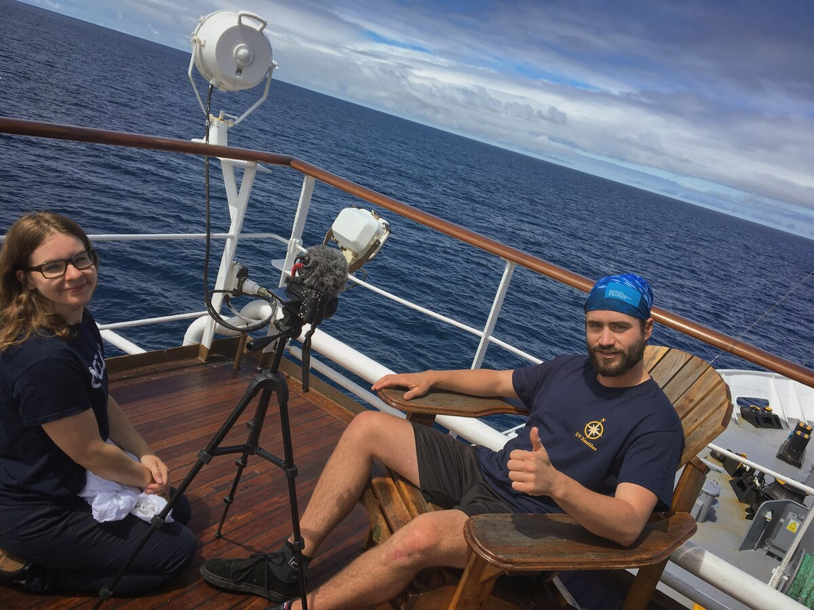
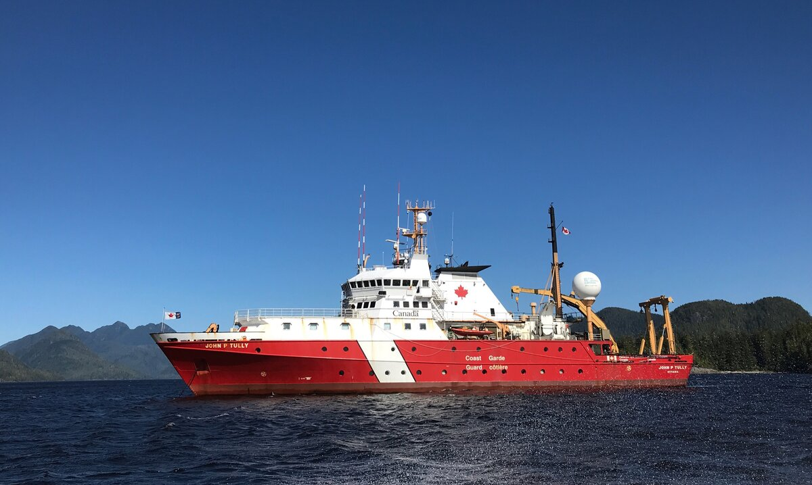
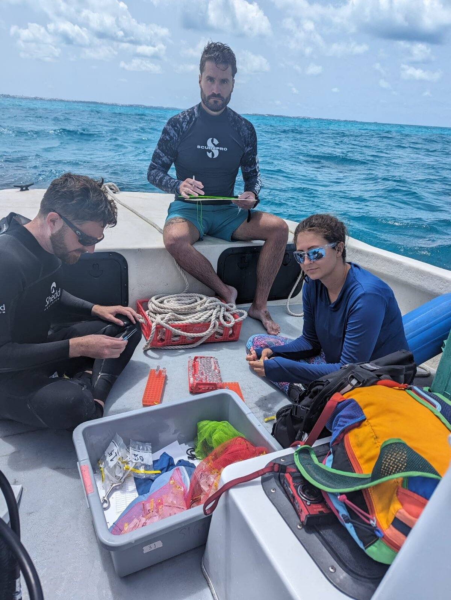

<figure class="banner-figure">
  
  <figcaption>Reef fish sampling, subtropical Atlantic.</figcaption>
</figure>

## Current work — BIOS-SCOPE Research Group

As a Research Fellow in the Marine Microbial Systems Lab at the Bermuda Institute of Ocean Sciences (ASU-BIOS), my research investigates how environmental variability and climate-driven disturbances reshape microbial community structure, metabolic networks, and biogeochemical cycles across diverse marine ecosystems — from oxygen-deficient zones to mangrove sediments and coral reefs.

**Research themes:**

- Microbial community assembly and network analysis in dynamic and oxygen-limited environments
- Nitrous oxide (N₂O) production and consumption by marine microbial communities, and its role in ocean-climate feedbacks
- Effects of marine heatwaves and hurricane disturbance on coral, mangrove, and benthic microbiomes
- Vertical transmission of symbiotic microbial assemblages in coral reproduction
- Seafloor ecosystem function under hypoxia and cumulative environmental stressors

<figure class="inset-figure">
  
  <figcaption>Prepping a sample for gas analysis, at sea.</figcaption>
</figure>

## Research trajectory

**Postdoctoral Scientist, Marine Benthic Ecology and Ecophysiology Lab** — BIOS/ASU *(2023–2026)*
Continued work on coral and mangrove ecosystem responses to climate disturbance, including marine heatwave and hurricane impact studies.

**PhD, Biological Oceanography** — University of Victoria *(2017–2023)*
Dissertation: *"The Microbial Ecology of Nitrous Oxide Production in Marine Environments: Linking Community Dynamics to Ecosystem Processes."* Advisor: Dr. S. Kim Juniper. Research on the NE Pacific oxygen minimum zone, Saanich Inlet, and mangrove sediment N₂O cycling, combining trace-gas microsensors, numerical modelling, 16S rRNA network analysis, and functional gene expression.

**B.Sc. (Hons.), Marine Biology** — Dalhousie University *(2016)*
Honours thesis on ocean acidification effects on coral primary productivity. Advisor: Dr. Alan Pinder.

## Teaching & curriculum development

**Co-Developer & Instructor**, Marine Microbial Ecology (BIOS Summer Course) *(2024–present)*
Co-conceptualized, co-designed, and implemented a new summer course for ASU-BIOS with Dr. Sheryl Murdoch. Awarded a pilot grant to design and test the course in 2025; the successful pilot led to the inaugural full course offering in summer 2026.

**Curriculum Designer & Instructor**, Biological Oceanography (BIOS Spring Semester Program) *(2026)*
Designed all course materials, including lectures, field exercises, and laboratory exercises; now serving as official course instructor.

## Field & sea time

Research expeditions with GeoTraces Atlantic Zonal Transect (R/V *Atlantic Explorer*, 2026), Ocean Networks Canada (*Wiring the Abyss*, *Seafloor Geodesy*, CCGS *John P. Tully*), and the 2018 Pacific Seamounts Expedition (R/V *Nautilus*). AAUS Scientific Diver with 200+ work-related dives.

  <figure>
    
    <figcaption>On-deck media interview, R/V <em>Nautilus</em>, 2018 Pacific Seamounts Expedition.</figcaption>
  </figure>
  <figure>
    
    <figcaption>CCGS <em>John P. Tully</em>, Ocean Networks Canada expedition.</figcaption>
  </figure>
  <figure>
    
    <figcaption>Processing sample kits between dives, Bermuda.</figcaption>
  </figure>

